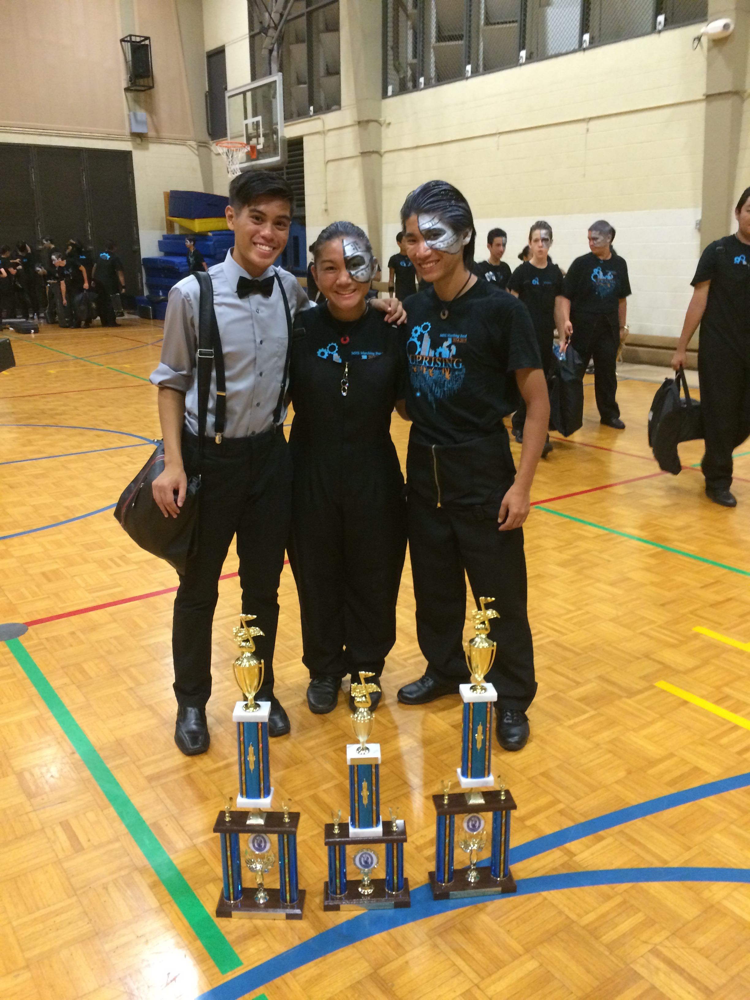
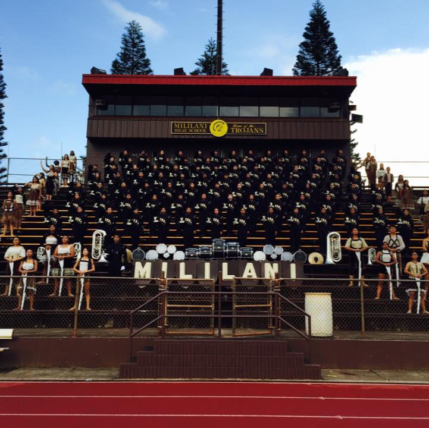

  
  

The Mililani High School "Trojan" Marching Band is one of the few marching bands in Hawai'i to compete in the Bands of America (BOA) national competition. From 2014-2015 I was a music and marching technician helping the head director complete tasks and direct students.

During my time there I travelled with the band to football games and local competitions, preping them for performances, and warming up the students before playing. I would also provide sectionals to some of the members who needed it and tutored the kids outside of practice days. The director would often ask for my input on some of the show designs, props, and also uniform changes. 

Previously I had studied music and played clarinet for seven years.

You can check out their 2014 show "Uprising" [here](https://youtu.be/4nNnZ9TMYiQ), and their 2015 show "Pandora's Box" [here](https://youtu.be/4RzY2tduelY).

Learn more about the band [on their website](http://www.mhsmarching.org).
