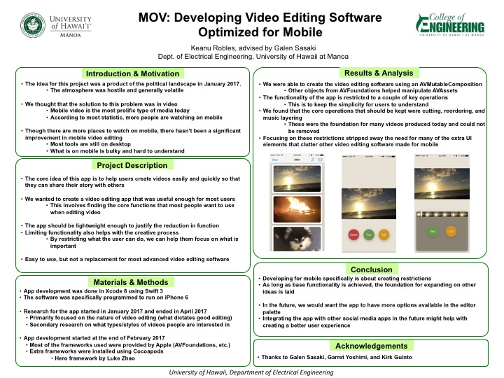
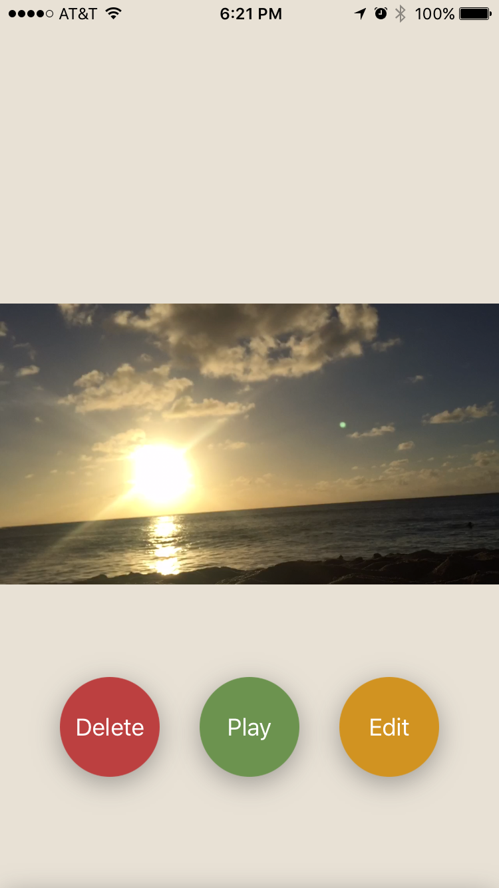
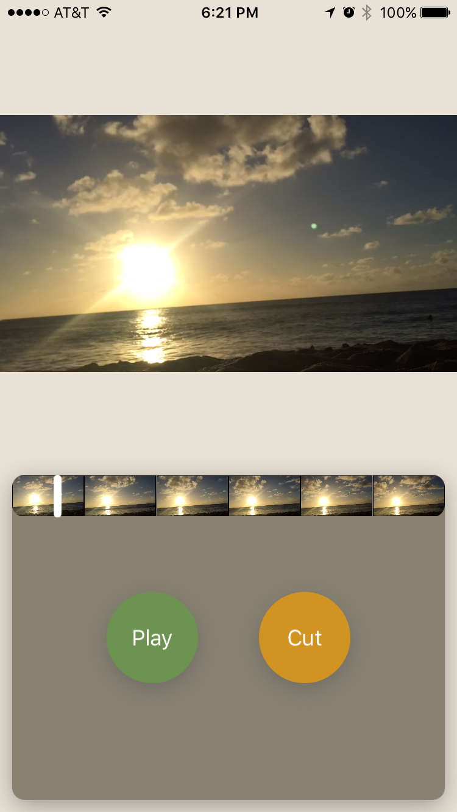

  

MOV is a video editing app for iOS that is optimized for a mobile experience. After researching, I found that while there are plentiful options when it came to video editing on your phone, many of them were focused on completely replicating desktop video editor features to fit on a phone, which made them confusing and complicated for the casual user. The goal for this project was to create a video editing app that stripped away the unnecessary features that cluttered most mobile video editors, while keeping the most fundemental elements that users were looking for. By doing this, I could encourage users to create more, and be more focused on the important aspects of video editing.

  
  
  

You can learn more about the project [here](https://youtu.be/Yi1vBJ1S6hA).
